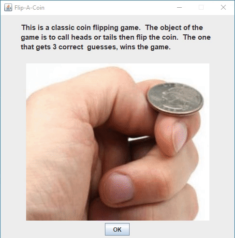

# CoinGame

This was my first Java game with graphics.  It used the Java AWT and Swing libraries and introduced me to event handling, and concurrency.

---

## Instructions:

1.  Open program
2.  Select Ok after Introduction
3.  Select one of the following
- Player vs Player
- Player vs Computer
- Simulate 100 Tosses

## Simulate 100 Tosses

1.  Select one of the following
- Back To Main Menu - Takes you back to the Main menu
- Quit - quits the game

## Game Play

1.  Choose Heads or Tails
2.  Flip Coin
3.  Observe result and select next Player
- if playing computer, select Continue

## Winning:

The first player to get 3 correct guesses wins the game
